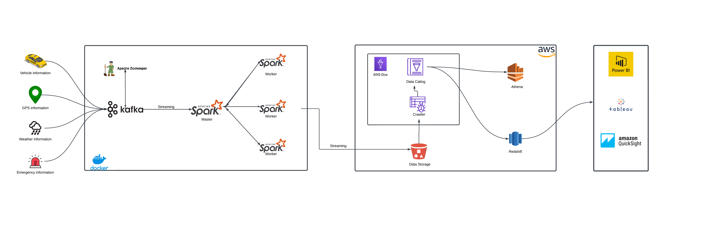

# Building a Smart City Real-time Data pipeline project

In this project, we use data and technology to improve urban infrastructure and services. By collecting and analyzing data 
on things like traffic, emergencies, weather information, and other statistical information, we aim to enhance urban livin



## This project leverages a powerful stack of technologies:

- Apache Kafka: Kafka is used as a messaging system to facilitate real-time data streaming and communication between different components of a smart city system.
- Apache Spark: Spark is used for real-time stream processing and data ingested from Kafka topics. .
- Amazon S3: Scalably stores raw Smart city data.
- AWS Glue: Catalogs and transforms data using pre-built and custom ETL jobs.
- Amazon Athena: Enables flexible SQL-based data transformation.
- Amazon Redshift: Serves as the central data warehouse for analytics and querying.
- Power BI: Facilitates data visualization and exploration.

## Key Features:

- Real-time Processing: Utilize Spark Streaming for real-time data processing from Kafka, enabling timely insights.

- Scalability & Fault Tolerance: Leverage Spark's distributed computing for scalable and fault-tolerant processing, even with large data volumes.

- AWS Glue Integration: Use AWS Glue for seamless data integration and transformation, preparing data for analytics.

- Amazon S3 Storage: Store processed data in Amazon S3 for scalable, durable, and long-term storage.

- Amazon Redshift Data Warehousing: Load transformed data into Amazon Redshift for complex analytics and insights generation.

- End-to-End Data Pipeline: Build a complete data pipeline from Kafka ingestion to Redshift analytics, ensuring data flow efficiency.

- AWS Services Integration: Integrate with various AWS services (S3, Glue, Redshift) for a robust and scalable cloud-based analytics solution.

## Getting Started:

- Prerequisites: AWS account, Docker, Python 3.9+
- Instructions: Detailed setup guide available

## Setup Guide

**Prerequisites:**

- AWS Account with S3, Glue, Athena, and Redshift permissions.
- Docker installed.
- Python 3.9 or higher.

**Steps:**

1. **Clone the Repository:**

   ```bash
   git clone [https://github.com/pratikm17/Building-a-Smart-City-real-time-data-Pipeline-Project.git](https://github.com/pratikm17/Building-a-Smart-City-real-time-data-Pipeline-Project.git)
   ```

2. **Configure Credentials:**
     Change AWS_ACCESS_KEY, AWS_SECRET_KEY, Bucket_Name in Spark_main.py file and also set Bucket as Publice

3. **Start Containers:**
    ```bash
    docker-compose up -d
    ```
4. Create This Kafka topics VEHICLE_TOPIC, GPS_TOPIC, WEATHER_TOPIC, EMERGENCY_TOPIC 

5. Run kafka_main.py help of Docker

6. Run Spark_main.py help of Docker

7. Now the Data Storge in S3
 
